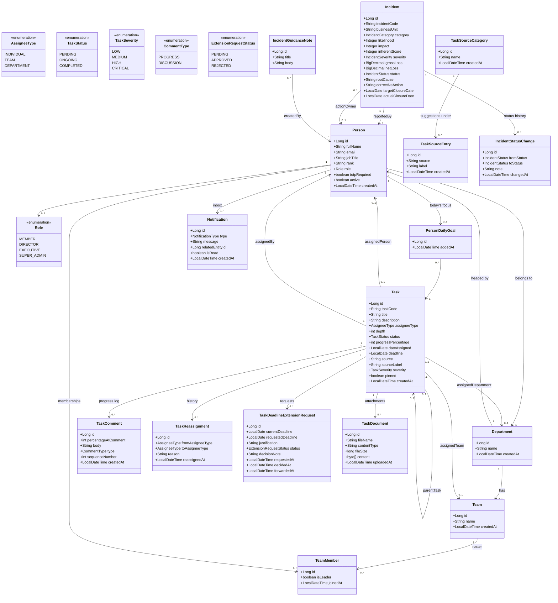

# Throughline  - Task Management System

Throughline is a task-progress tracking system built around one rule: **every percentage
is justified by a dated comment, and every reassignment is justified by a reason.** It's
themed around a Rwandan military/banking hierarchy (ranks, Directors, an Executive/CEO
seat, Departments), but underneath that theming it's a general-purpose "who's doing what,
how far along is it, who said so, and who signed off on it" tracker.

This README covers the whole system: the Spring Boot backend and the React frontend, how
to navigate the codebase, how to download and run it on your own machine, how its
configuration works, its data model, and what must never end up in version control. It is
written for someone opening this project for the first time.

## Contents

- [What it does](#what-it-does)
- [Who uses it: roles at a glance](#who-uses-it-roles-at-a-glance)
- [Use case diagram](#use-case-diagram)
- [Domain model: class diagram](#domain-model-class-diagram)
- [Tech stack](#tech-stack)
- [Project structure](#project-structure)
- [Prerequisites](#prerequisites)
- [Downloading and running it locally, step by step](#downloading-and-running-it-locally-step-by-step)
- [Configuration reference](#configuration-reference)
- [Roles & permissions](#roles--permissions)
- [Security: what must never be committed](#security-what-must-never-be-committed)
- [Testing](#testing)
- [Known limitations](#known-limitations)
- [Where to look next](#where-to-look-next)

## What it does

- **Four-tier task hierarchy.** The Executive (CEO) seat can hand a mandate straight to a
  whole **Department**. That Department's head Director turns it into a real
  **implementation task**, assigned to a team or an individual, one level deeper. A
  Director can also skip the Department step entirely and create an ordinary top-level task
  assigned straight to a **team** (which can be broken into **subtasks** for individual
  members) or straight to one **person**. Depth is capped at 2, and only a Department-rooted
  chain ever reaches it.
- **Progress only moves one way.** A task's percentage never gets edited directly; it
  changes only when someone adds a dated progress comment on an individually-tracked task.
  A team/department task's percentage is always the automatic roll-up (average) of its
  children. Status (Pending/Ongoing/Completed) is derived from the percentage. Progress on
  an individually-assigned task can only be logged by its assignee, the leader of a team
  that assignee belongs to (their own team only), or a Director/Executive/Super Admin,
  enforced server-side.
- **Reassignment needs a reason, and isn't open to everyone.** A mandatory written reason
  is required, and only a Director/Executive/Super Admin, or the task's own Team Leader,
  can do it, scoped to who actually has standing over that specific task.
- **Deadline extensions follow the chain of command.** Whoever is doing the work requests
  more time; the request goes to that task's real decider (never just whoever created it:
  a Team Leader can create a leaf subtask but never owns its deadline). On a chain that
  originated from the CEO's own mandate, a Director can still reject a request but can only
  *forward* it for approval; only the CEO/Super Admin can actually approve one.
  Deadlines can also be extended directly, without the request/approval round-trip, and
  that is still logged as a self-approved entry so the audit trail has no gap.
- **Teams and Departments.** A person can belong to more than one team at once; each team
  has exactly one Leader. Every team and every person belongs to exactly one Department.
  Every membership change (added/removed/leader reassigned) is logged with who did it and
  why.
- **People & roles.** Four global roles, ascending:
  `MEMBER < DIRECTOR < EXECUTIVE < SUPER_ADMIN`. "Team Leader" and "Department Head" are
  *not* global roles; they're scoped per-team / per-department, so the same person can
  hold one on some teams/departments and not others. See
  [Roles & permissions](#roles--permissions).
- **Auth.** JWT-based login. There is no public self-registration: only a Super Admin can
  create a new account, password included, and it's login-ready immediately. The whole
  system is deliberately mail-free — no SMTP, no OTP emails, no external notification
  service of any kind — so it keeps working with zero internet connectivity. Forgot your
  password? "Forgot Password?" first tells you plainly whether that email even has an
  account (rate-limited server-side against being used to scan the whole roster), and if it
  does, asks you to confirm before creating a request a Super Admin gets notified about and
  resolves from that person's profile page by setting a new password directly, which they
  then hand over to you themselves.
- **Two-factor authentication (TOTP).** Every account created from now on also requires an
  authenticator app (Google Authenticator, Authy, etc. — RFC 6238, an open standard, not
  tied to any one app). First login after a Super Admin creates the account shows a QR
  code to scan and a batch of one-time recovery codes (shown exactly once); every login
  after that needs email + password + a 6-digit code. A recovery code can stand in for the
  code if the phone is unreachable, and consuming one re-triggers enrollment on the very
  next login, since it assumes the original device is gone. Verification is pure local
  computation against the stored secret — no network call, so it works fully offline just
  like the rest of login. Accounts that already existed before this rollout are
  unaffected: 2FA only applies going forward, to newly created accounts. A Super Admin can
  reset someone's enrollment from their profile page for a lost/replaced phone.
- **Visibility is role-scoped, server-side**, not just hidden in the UI. A Member only ever
  sees tasks assigned to them directly or to a team they belong to, their own teammates on
  the People page, and (for a team/department they aren't on) just its name and who leads
  it. A plain Director is scoped to their own department. Executive/Super Admin see
  everything, everywhere.
- **Daily goals.** A Member can flag up to 3 of their own assigned tasks (including their
  own subtasks) as "what I'm focused on today," shown at the top of their dashboard, meant
  to cut through the noise when someone has many tasks at once.
- **Supporting documents.** Any file (memo, spec, directive) can be attached to a task and
  downloaded later by anyone who can already see that task.
- **Extensible Source categories.** A task can record where it originated (e.g.
  Initiative, Regulator, Auditor, Board) from an open, admin-extensible list, plus a free
  "Source Detail" field — always typed by hand, no clickable suggestions to pick from
  instead.
- **Incident management.** A replacement for the bank's manual IT incident register
  (an Excel workbook), inside the same app. Directors, Executives and Super Admins report
  an incident; a confirmation step comes before anything is recorded. The Excel's formulas
  are reproduced live in the form and always recomputed on the server: Inherent Score
  (Likelihood × Impact) and its Severity band (Low / Moderate / High / Critical), Net Loss,
  Days Open and Action SLA (including a "closed late" flag the Excel never had). Status
  follows the Excel exactly (Open → Under Investigation → Monitoring → Closed, or Rejected /
  Not an Incident), every change is logged, and **closing is blocked** until root cause and
  corrective action are filled in, plus Risk and Compliance review for Critical/High or
  regulator-notifiable incidents. **Business Unit is the list of Departments**, so a new
  department appears in the dropdown automatically. The dashboard has KPI tiles, status/
  severity/category charts, a monthly trend and SLA compliance, and a filterable, searchable
  incident list. A **Guidance** page carries the Excel's severity/escalation table, score
  scale and closing checklist read-only, plus notes a Director-or-above can add for new
  reporters.
- **In-app notifications**, always sent to the affected person, for: task/subtask
  assignment and reassignment, deadline-extension requests/approvals/rejections/forwards,
  discussion replies, team membership changes, role changes, account (de)activation, and
  TOTP resets. The one exception is a password-reset request, which broadcasts to every
  Super Admin instead (only they can resolve it), and says plainly if the account is
  currently deactivated — that's flagged for a Super Admin specifically, never for the
  person who submitted the request. New teams/departments/task-deletions also broadcast,
  backing small "new activity" badges next to the relevant sidebar item. A newly reported
  incident notifies every Director-or-above, and assigning an incident's Action Owner
  notifies that person. A daily job deletes read notifications older than 90 days, and any
  older than a year.
- **Director/Executive dashboards.** Org-wide KPIs, a progress-over-time trend line, a
  status-mix donut, a team leaderboard, a people summary, a "my initiatives" panel, and
  (for Executive/Super Admin) a department-by-department traffic-light health roll-up
  and a "Critical & CEO-assigned" panel.
- **Global search** across people and tasks from the top bar, from anywhere in the app.
- **Audit trail.** A merged Director-or-above Activity feed covering task creation/
  deletion, role changes, account activation/deactivation, and department deletion, all in
  one place.
- **Accounts are deactivated, never deleted.** A Super Admin can lock an account without
  losing that person's task/comment/reassignment history.

## Who uses it: roles at a glance

| Role | Who they are in the theming | What sets them apart |
|---|---|---|
| **Member** | An ordinary staff member | Sees only their own work; can log progress on tasks assigned to them, comment, pick daily goals |
| **Team Leader** *(per-team, not a global role)* | Whoever leads one specific team | Can create/reassign that team's own tasks and log progress for their team's members, same standing as a Director but scoped to their team |
| **Director** | A department's day-to-day manager | Creates teams/tasks, sees their whole department, decides deadlines for their own tasks, reports and manages incidents |
| **Department Head** *(per-department, not a global role)* | The one Director accountable for a whole Department | Turns the CEO's Department-level mandate into a real implementation task |
| **Executive** | The CEO | Hands mandates to whole Departments, sets task severity, approves CEO-mandated deadline extensions, org-wide read view |
| **Super Admin** | System governance & technical support | Not a business role like the others: exists to administer the system itself and the org structure inside it. Everything Executive can do, plus creating user accounts (the only way anyone gets into the system in the first place), granting/revoking roles, (de)activating accounts, department administration |

## Use case diagram

Four actors use this system: **Member**, **Director**, **Executive/CEO**, and **Super
Admin**, plus one external actor, the **Email System**, which delivers OTP/invite/
notification/reset emails on the app's behalf. Every role can log in, recover a locked-out
account, search people and tasks, and receive notifications. From there each role's reach
narrows: a Member only manages their own assigned work and daily focus goals; a Director
and the Executive both manage tasks and deadline extensions (a Director within their own
department, the Executive org-wide, with Department-level authority besides); and a Super
Admin owns org-structure governance (teams, departments, and people/roles) on top of the
same dashboard and audit-log visibility a Director and Executive get. `<<include>>` arrows
mark a step a use case always performs (e.g. "Manage tasks" always includes creating and
reassigning a task); `<<extend>>` arrows mark an optional one that only sometimes applies
(e.g. forwarding a deadline-extension request to the CEO only happens on a CEO-mandated
task chain).


## Domain model: class diagram

This is the real JPA entity model (`TaskTracker_BE/.../model/*.java`), trimmed of getters/
setters and the smaller append-only audit tables (`RoleChange`, `AccountStatusChange`,
`TeamMembershipChange`, `TaskActivity`, `DepartmentActivity`, each the same shape:
who/what changed, who changed it, an optional reason, and a timestamp, all insert-only,
never updated). `Person` sits at the center of the org chart: each one belongs to exactly
one `Department` and holds a `Role`, and can join several `Team`s through the `TeamMember`
join entity. `Task` is the other core entity, assigned to a `Team`, a `Person`, or a whole
`Department`, optionally nested under a `parentTask`, and carrying its own progress log
(`TaskComment`), reassignment history, deadline-extension requests, and attached
documents. `PersonDailyGoal` links a person to up to 3 tasks they're focused on right now,
`TaskSourceCategory`/`TaskSourceEntry` back the task-origin picklist, and `Notification`
is every person's own inbox. `Incident` is a separate record type from `Task`: it keeps its
own status history (`IncidentStatusChange`), and `IncidentGuidanceNote` holds the editable
guidance shown to incident reporters.



## Tech stack

**Backend**: Java 21 · Spring Boot 4.1.1 · Spring Security (JWT via `jjwt` 0.12.6) ·
Spring Data JPA / Hibernate 7.4.5 · PostgreSQL · Maven (wrapper included, no separate
Maven install needed).

**Frontend**: React 19 · TypeScript · Vite · React Router v6 · TanStack Query for all
server state · Axios · Recharts for charts · plain CSS Modules (no Tailwind, no component
library).

## Project structure

```
Task_Tracker/
├── README.md          This file
├── TaskTracker_BE/    Spring Boot API (http://localhost:8080)
│   ├── src/main/java/com/throughline/taskmanagement/
│   │   ├── model/          JPA entities (the class diagram above)
│   │   ├── repository/     Spring Data repositories
│   │   ├── service/        Business logic interfaces + impl/
│   │   ├── controller/     REST endpoints
│   │   ├── dto/             request/ and response/ records
│   │   ├── enums/          Role, TaskStatus, AssigneeType, IncidentStatus, ...
│   │   ├── scheduling/     Daily jobs (stalled-task alerts, old-notification cleanup)
│   │   └── security/       JWT filter, current-user resolution
│   ├── seed-data/          Gitignored SQL: Super Admin bootstrap + demo dataset
│   └── src/test/java/...   Real-database integration tests (see Testing)
└── TaskTracker_FE/    React app, Vite (http://localhost:5173)
    └── src/
        ├── features/        one folder per feature area (tasks, taskDetail, people, teams, departments, incidents, dashboard, auth, notifications, search)
        ├── components/      shared UI (ui/) and layout (layout/) building blocks
        ├── api/             axios client + endpoint URL builders
        └── types/           TypeScript types mirroring the backend DTOs
```

They're two independent projects that only talk to each other over HTTP; there's no
shared build step, no monorepo tooling. Run each with its own toolchain, in its own
terminal.

## Prerequisites

- **Java 21** (JDK)
- **Node.js** 18+ and npm
- **PostgreSQL**, running locally (or reachable), with a database you'll create in step 1
- **Git**, to clone the repository

Nothing else — there's no mail account to set up. The whole system is deliberately
mail-free (see [Auth](#what-it-does) above), so it runs the same with or without
internet access.

## Downloading and running it locally, step by step

### 0. Get the code

```bash
git clone <the repository's URL>
cd Task_Tracker
```

(If you were handed a zip file instead of a git URL, just unzip it and `cd` into the
resulting folder; everything below is the same either way.)

### 1. Create the database

```sql
CREATE DATABASE task_tracker_db;
```

That's the only manual schema step. Hibernate's `ddl-auto=update` creates and updates
every table automatically from the JPA entities the first time the backend boots; there
are no migration files to run.

### 2. Create your local config file

This is **gitignored**: a fresh clone doesn't come with it, on purpose, since it holds
every real local credential the app needs.

`TaskTracker_BE/src/main/resources/application.properties`
```properties
spring.application.name=Throughline

spring.datasource.url=jdbc:postgresql://localhost:5432/task_tracker_db
spring.datasource.username=postgres
spring.datasource.password=your_postgres_password
spring.jpa.hibernate.ddl-auto=update
spring.jpa.show-sql=true

spring.datasource.driver-class-name=org.postgresql.Driver
spring.jpa.database-platform=org.hibernate.dialect.PostgreSQLDialect

# A long, random string that signs every login token. Generate one with, e.g.:
#   openssl rand -base64 64
# (any long random string works; it doesn't have to be Base64 specifically)
app.jwt.secret=paste_a_long_random_string_here
app.jwt.expiration-ms=86400000

# AES-256 key (32 raw bytes, Base64) encrypting every stored TOTP 2FA secret at rest.
# Generate one with:
#   openssl rand -base64 32
# Losing/rotating this makes every already-enrolled account's secret unreadable, forcing
# them all back through TOTP enrollment — generate once, keep stable.
app.totp.encryption-key=paste_a_different_base64_key_here
```

No mail configuration, no second config file — the app has no SMTP dependency at all.
`application.properties` itself is not optional: no datasource credentials means no
database connection, which means Spring fails to start.

### 3. Bootstrap the first Super Admin

There's no self-service way to create a Super Admin through the app itself; the only way
to get a new account at all is an *existing* Super Admin creating one from the People page
(and even a Director creating a new person can only ever hand them Member by default). So
the very first account has to be inserted directly, after the backend has booted at least
once (so the `persons` table and its columns already exist):

```sql
INSERT INTO persons (full_name, email, password, job_title, rank, role, active, created_at)
SELECT 'Your Name', 'you@example.com', 'ChooseAPassword123',
       'System Administrator', NULL, 'SUPER_ADMIN', true, NOW()
WHERE NOT EXISTS (
    SELECT 1 FROM persons WHERE email = 'you@example.com'
);
```

That password is stored exactly as typed; see
[Security notes](#security-what-must-never-be-committed) for why, and don't reuse a
real password of yours here.

**Optional demo data.** `TaskTracker_BE/seed-data/seed_task_management.sql` (kept locally,
not in git) fills the database with a demo org: departments matching the incident business
units, their teams and people (no authenticator needed for the demo accounts, password
`12345678`), and a full task hierarchy. Open it in pgAdmin's Query Tool and run it; it is
safe to re-run and never deletes an existing person or touches incidents.

### 4. Run the backend

```bash
cd TaskTracker_BE
./mvnw spring-boot:run          # macOS/Linux
mvnw.cmd spring-boot:run        # Windows
```

Starts on `http://localhost:8080`.

### 5. Run the frontend

```bash
cd TaskTracker_FE
npm install
npm run dev
```

Starts on `http://localhost:5173`. It talks to the backend at a **hardcoded**
`http://localhost:8080` (`src/api/axiosClient.ts`); the backend has to be running on
exactly that port; there's no environment variable to point it elsewhere yet.

### 6. Log in

Go to `http://localhost:5173/login` and sign in with the Super Admin email/password from
step 3. From there, use the People page to create a Department, then Directors and
ordinary Members. Creating a person is fully offline — you set their password directly,
and it's login-ready immediately. Their first login walks them through TOTP enrollment:
scan the QR code shown with an authenticator app, enter the 6-digit code to confirm, and
save the one-time batch of recovery codes shown right after — every login after that needs
the authenticator code too.

## Configuration reference

All in the one gitignored file from step 2 above.

### `application.properties`

| Property | What it does |
|---|---|
| `spring.application.name` | App name, cosmetic only |
| `spring.datasource.url` | Which database to connect to (host/port/db name) |
| `spring.datasource.username` / `spring.datasource.password` | Your local Postgres credentials |
| `spring.datasource.driver-class-name` / `spring.jpa.database-platform` | PostgreSQL driver/dialect |
| `spring.jpa.hibernate.ddl-auto=update` | Auto-creates/updates tables from the entities. Only ever **adds** structure, never drops or alters an existing column/constraint (see [Known limitations](#known-limitations)) |
| `spring.jpa.show-sql` | Logs every SQL statement; handy in dev, noisy at scale |
| `app.jwt.secret` | Signs every login token. **If this leaks, anyone who has it can forge a valid login as any user, including a Super Admin**; see the security note below |
| `app.jwt.expiration-ms` | How long a login token stays valid, in milliseconds (currently 24 hours) |
| `app.totp.encryption-key` | AES-256 key encrypting every stored TOTP secret at rest. **If this leaks, every already-enrolled account's 2FA secret is exposed**; losing/rotating it forces everyone back through enrollment |

## Roles & permissions

| Role | Can do |
|---|---|
| **Member** | See only: tasks assigned to them directly, tasks assigned to any team they belong to, their own teammates on the People page, and (for teams/departments they aren't on) just the name and who leads it. Log progress on tasks assigned to them, comment, pick up to 3 daily focus goals |
| **Team Leader** *(per team, not a global role)* | Everything a Member sees, plus: create/reassign subtasks and reassign the top-level task for their own team, log progress for members of that team, same standing as a Director but scoped to just that one team |
| **Director** | Full visibility over their own department; create teams and top-level tasks (team- or individually-assigned) within it; create implementation tasks under a Department task their department heads; decide/forward deadline extensions for their own tasks; report, edit and change the status of incidents; add and edit incident guidance notes; log progress on any individually-assigned task; their own "My Initiatives" and "Critical & CEO-assigned" dashboards |
| **Department Head** *(per department, not a global role)* | The Director accountable for turning a Department-level task the CEO assigned into a real team-or-individual implementation task |
| **Executive** | Everything a Director can do, org-wide, plus: create tasks assigned straight to a whole Department, set task severity, approve deadline extensions on CEO-mandated chains, create new departments, the org-wide Executive dashboard (department health roll-up, KPI tiles) |
| **Super Admin** | A governance/system-support role, not a business one: owns the org's technical administration rather than its day-to-day work. Everything an Executive can do, plus: create new people/accounts (the only route onto the platform — there is no public self-registration), promote/demote anyone to any role, deactivate/reactivate any account, rename departments and reassign their head, reset someone's TOTP enrollment for a lost/replaced phone, view every org-wide audit log |

## Security: what must never be committed

- `TaskTracker_BE/src/main/resources/application.properties`: gitignored.
- `TaskTracker_BE/seed-data/`: gitignored; contains real names/emails used during
  development.
- Anything containing a database password, the JWT signing secret, the TOTP encryption
  key, or real personal data of any kind.
- **Passwords are stored in plain text in this project**: a deliberate, explicit choice
  (see the `NoOpPasswordEncoder` comment in `SecurityConfig.java`), made during development
  so a forgotten password can just be looked up and remembered instead of reset every time,
  and so it's easy to eyeball the right value directly in the database while testing. That
  means anyone with database access can read every password directly. That's an acceptable
  trade-off for a local/internal/demo tool; it is **not** acceptable for deployment, and
  hashing passwords properly before then is planned as standard practice, not optional
  hardening. Swapping back to `new BCryptPasswordEncoder()` is a one-line change in
  `SecurityConfig`, and nothing else in the auth code needs to change either way.
- **TOTP secrets are the one exception to that plaintext choice.** Unlike a password,
  nobody ever needs to look a TOTP secret up by eye — the app only ever reads it back to
  compute a code — so `Person.totpSecret` is encrypted at rest (AES-256-GCM, see
  `TotpSecretCipher`/`TotpSecretConverter`) even in this same dev-only setup. A leaked
  secret is worse than a leaked password: it lets an attacker generate valid codes
  silently and indefinitely, with no failed-login trail to notice.

If this repository has ever been pushed to a public remote with real credentials inside
that config file, treat those credentials as burned: rotate `app.jwt.secret` (a fresh
random string immediately invalidates every existing login token; everyone, including
you, needs to log in again) and change the exposed Postgres credentials. Untracking
a file from git (`git rm --cached`) only stops *future* commits from carrying it; it does
nothing to old commits that already have it, which remain fully recoverable from history
for anyone with a clone. Fully scrubbing old values out of history (e.g. with
`git filter-repo`) is a further, disruptive step beyond that, since it rewrites every
commit hash.

## Testing

- **Backend** has a real integration test suite (`TaskTracker_BE/src/test/java/...`):
  `@SpringBootTest` classes that run against the actual seeded database (not mocks), which
  has repeatedly caught real bugs a mocked test can't (e.g. a Hibernate query silently
  compiling a nullable-association path as an `INNER JOIN` and dropping rows). Several of
  them look up seeded people, departments and teams by name, so load the demo data first
  (see step 3). Run it with:
  ```bash
  cd TaskTracker_BE
  ./mvnw test          # macOS/Linux
  mvnw.cmd test         # Windows
  ```
- **Frontend** has no automated test suite; verification is `npx tsc --noEmit` (type
  check) and `npx vite build` (production build), run from `TaskTracker_FE/`.

## Known limitations

- **No automated frontend test suite.** See [Testing](#testing) above.
- **An account that signed up before this project switched to plain-text passwords is
  permanently locked out of login**, since its stored value is an old BCrypt hash and
  `NoOpPasswordEncoder` does a raw string comparison; no plaintext a person types will
  ever equal a bcrypt hash again. The only fix is an admin directly overwriting that
  person's `password` column via SQL.
- **`ddl-auto=update` only ever adds schema; it never alters or drops anything
  existing.** Several times in this project's history, adding a new value to a Java enum
  (`Role`, `NotificationType`), or loosening a column from a fixed enum to open text
  (`Task.source`, `Incident.businessUnit`), required dropping a stale Postgres `CHECK`
  constraint, because Hibernate had generated that constraint against the column's *old*
  shape and will never update it on its own. (For `incidents.business_unit` the app now
  drops it itself at startup, in `IncidentSchemaMigration`.) If a value that should be valid fails to
  insert with a constraint violation, this finds the culprit:
  ```sql
  SELECT conname, pg_get_constraintdef(oid)
  FROM pg_constraint
  WHERE conrelid = 'TABLE_NAME_HERE'::regclass AND contype = 'c';
  ```

## Where to look next

- `TaskTracker_BE/README.md`: an early curl-based API reference. Parts of it (especially
  the People/Teams request & response shapes) reflect an earlier version of the API, from
  before the task hierarchy/multi-team/Department/auth rework; treat it as historical
  background, not a current source of truth.
- `TaskTracker_FE/README.md`: the frontend's folder structure and conventions.
- `TaskTracker_BE/seed-data/README.md`: the Super Admin bootstrap and the demo dataset
  script, if you want a known, fully-populated org chart.
